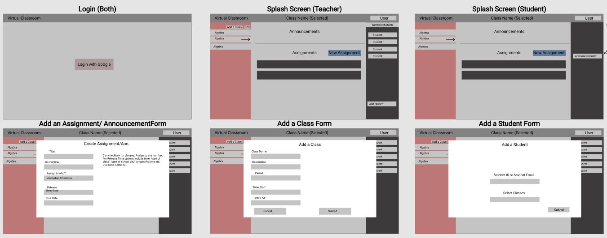
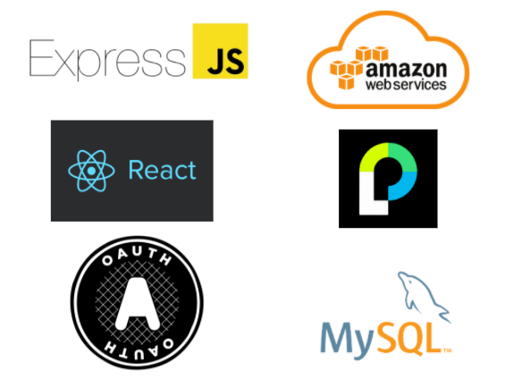
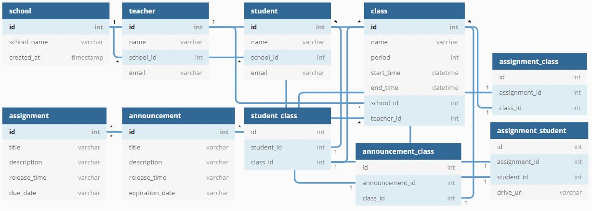

# virtualclassroom

An app to help you be the best educator you can be.

## Team

- **Product Owner**: Christopher Stumpe (Database, Design)
- **Scrum Master**: Brianna Skinner (Backend, Frontend)
- **Lead Engineer**: Gregory Thompson (Deployment, Frontend)

## Table of Contents

1. [How it works](#how-it-works)
2. [App Wireframe](#wireframe)
3. [Tech Stack](#tech-stack)
4. [Database](#database)
5. [Development](#development)
6. [System Requirements](#system-requirements)
7. [Installation](#installation)

## <a name="how-it-works"></a>1. How it Works

> Custom student and teacher accounts

> Students can submit their assignments

> Teachers can add classes, assignments, announcements, and students to their roster


## <a name="DB Setup"></a>DB Setup

First, install PostgreSQL 12 on your machine:
https://www.postgresql.org/download/

Then, use `node -v` to check your current version of Node. Upgrade to 12, if not currently on version 12.

service postgresql start              // start postgresSQL
psql -U root                          // log in to postgreSQL with your password
CREATE DATABASE virtualclassroom;    // create postgreSQL database
\c virtualclassroom;                 // connect to virtualclassroom database
npm run start                       // starts development server
npm run test-db                     // tests database commands and populates w/ sample data


Environment Variables for DB
Place in a .env file in outermost directory

env_variables:
  DB_USERNAME                     // PostgreSQL login username
  DB_PASSWORD                     // PostgreSQL password
  DB_HOST                         // database host (default=localhost)
  DB_PORT                         // database port (default=5432)
  DB_DBNAME                       // database name (default=virtualclassroom)


## <a name="wireframe"></a>App Wireframe

> Assignment and announcements have customizable release times

## <a name="wireframe"></a>2. App Wireframe



## <a name="tech-stack"></a>3. Tech Stack



## <a name="Database"></a>4. Database



## <a name="development"></a>5. Development

Setting up a development environment requires global installations of the latest stable version of node and node project manager(npm).

### <a name="system-requirements"></a>6. System Requirements

- Globally installed [node](https://nodejs.org/en/) >= 12.18.4

- Globally installed [npm](https://www.npmjs.org/) >= 6.14.8

## <a name="installation"></a>7. Installation

On the command prompt run the following commands

```sh
$ git clone git@github.com:your-username/virtualclassroom.git

$ cd virtualclassroom/

$ npm install
```

## <a name="script"></a>3. Script Order of Execution

**For Local Database**

virtualclassroom uses **Postgresql** which requires a global installation of **Name Here** . Installation instructions are provided [here]()

- Run the following command in your terminal to run local server:

```
$
```

**For Client Compiling**

- Run the following command in your terminal to run webpack:

```sh
$ npm run dev
```

**For Running Server**

- Run the following command in your terminal to run local server:

```sh
$ npm start
```

## <a name="contributing"></a>Contributing

See [CONTRIBUTING.md](CONTRIBUTING.md) for contribution guidelines.
